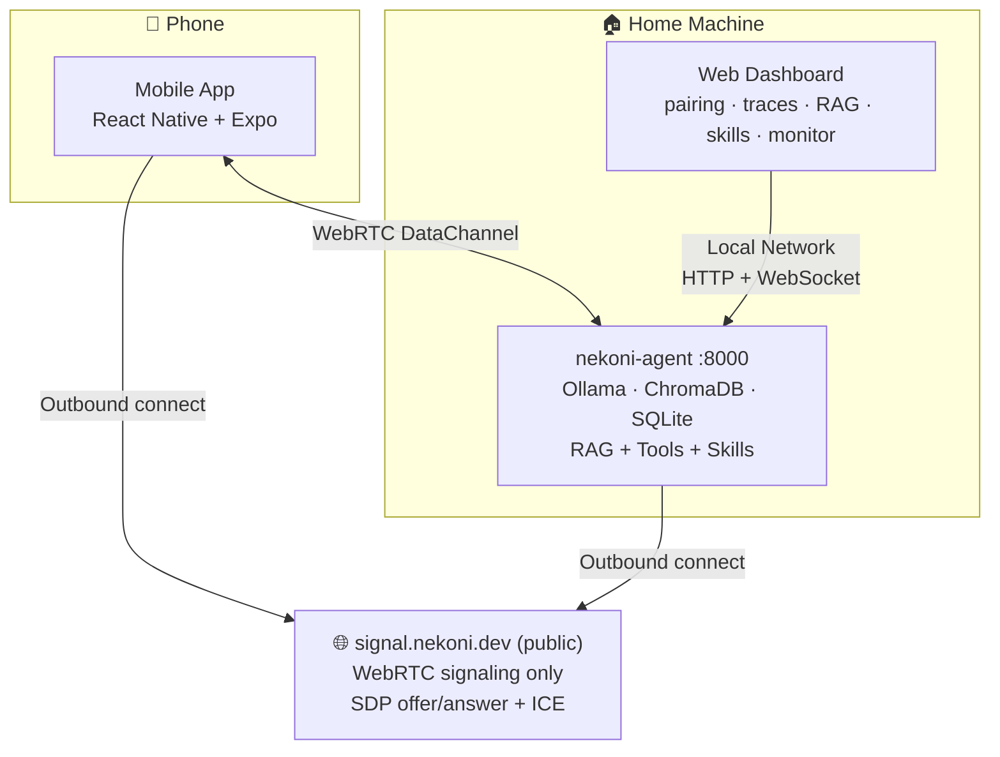
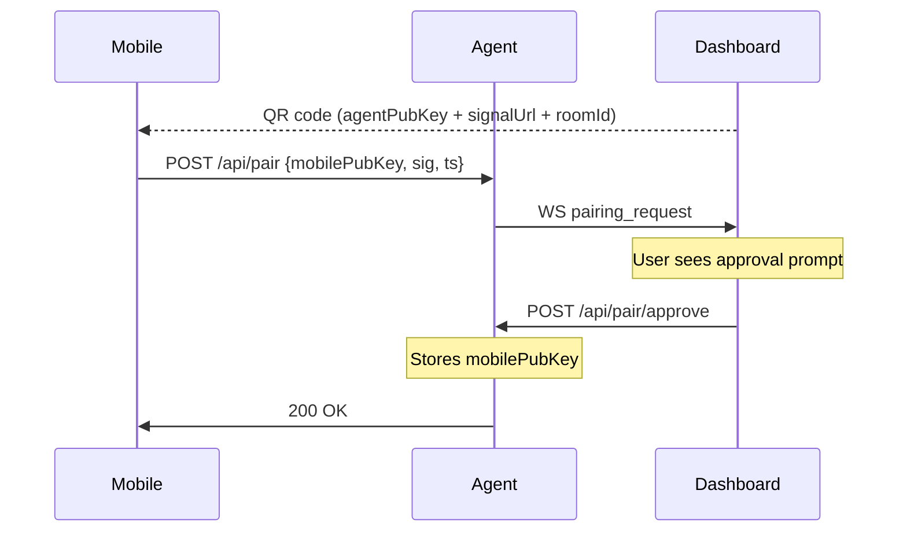
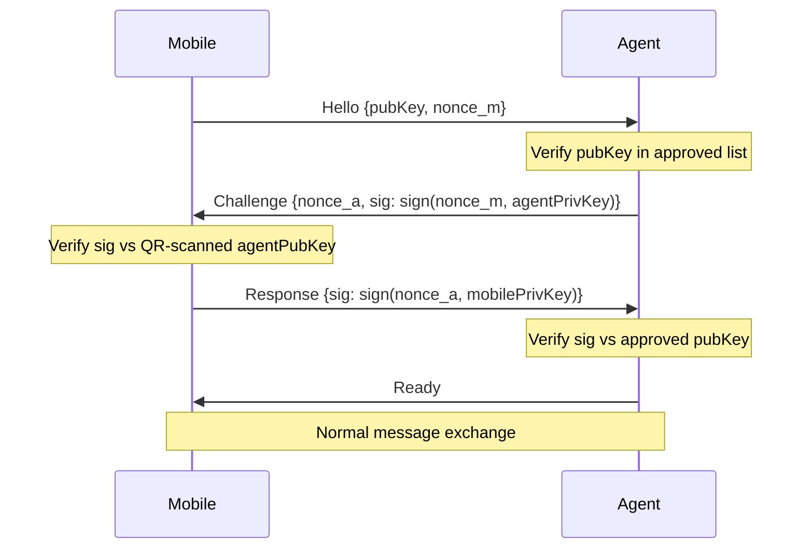

<p align="center">
  
</p>

# nekoni

A locally-run AI agent on your home machine, accessible from your phone via P2P WebRTC. No cloud. No subscription. Your data stays on your hardware.



## Features

- **Fully local** — LLM inference via Ollama (any model), embeddings via sentence-transformers, vector search via ChromaDB
- **P2P transport** — direct WebRTC DataChannel mobile ↔ agent, no relay; public signal server used only for SDP/ICE exchange
- **Key-pair security** — Ed25519 identity keys, mutual auth handshake, no passwords
- **RAG** — ingest documents (PDF, TXT, MD, CSV), query from chat; manage from dashboard or phone
- **Skills** — named prompt templates that run through the agent; schedule them via cron from dashboard or phone
- **Extensible** — add tools (atomic, LLM-invokable) in a few lines of Python
- **Observable** — live trace stream to web dashboard, filterable by session

## Tech Stack

| Component  | Tech                                                                     |
| ---------- | ------------------------------------------------------------------------ |
| Agent      | Python 3.12 · FastAPI · uvicorn · aiortc                                 |
| Signaling  | Node.js 22 · TypeScript · ws · express                                   |
| Dashboard  | React 19 · Vite · TypeScript · Radix UI Themes                           |
| Mobile     | React Native · Expo · react-native-webrtc                                |
| LLM        | Ollama (any model)                                                       |
| Embeddings | sentence-transformers (all-MiniLM-L6-v2)                                 |
| Vector DB  | ChromaDB (embedded, file-based)                                          |
| State      | SQLite + aiosqlite                                                       |
| Crypto     | Ed25519 — cryptography (Python) · @noble/ed25519 (Node) · tweetnacl (RN) |
| Monorepo   | pnpm workspaces + uv                                                     |

---

## Prerequisites

- [Docker Desktop](https://www.docker.com/products/docker-desktop/)
- `make` (macOS/Linux: built-in; Windows: via [choco](https://chocolatey.org/) or WSL)
- ~4 GB disk for Ollama model

Everything else (Ollama, uv, Python, pnpm) is installed by `make install`.

---

## Quick Start

```bash
git clone https://github.com/nekonihq/nekoni && cd nekoni

# Copy env template and adjust as needed (DASHBOARD_PASSWORD at minimum)
cp .env.example .env

# Install prerequisites (Ollama, uv, pnpm)
make install

# Pull the AI model (once)
make pull

# Start everything — dashboard in Docker, agent on host
make up
```

| Service   | URL                    |
| --------- | ---------------------- |
| Agent API | http://localhost:8000  |
| Dashboard | http://localhost:8080  |
| Ollama    | http://localhost:11434 |

To change the model, update `OLLAMA_MODEL` in `.env` and run `make pull` again.

### Stop

```bash
make down
```

---

## Development

The agent runs on the host (not in Docker) so WebRTC works correctly on all platforms — `make up` handles this automatically.

For dashboard hot-reload during development:

```bash
# Terminal 1 — Ollama + agent
make up

# Terminal 2 — dashboard dev server (port 5173)
pnpm install
pnpm dev:dashboard
```

---

## Mobile App

```bash
cd apps/mobile
pnpm install
pnpm start          # starts Expo dev server
# then press i (iOS) or a (Android)
```

**First launch flow:**

1. App opens camera to scan QR code
2. Open dashboard → **Pair** page — QR code is displayed
3. Scan the QR code — pairing request is sent to agent
4. Dashboard shows approval prompt — click **Approve**
5. App navigates to chat, connects automatically

---

## Project Structure

```
nekoni/
├── packages/
│   └── shared-types/          # TypeScript types shared across all JS/TS packages
│       └── src/
│           ├── signaling.ts   # SignalMessage, AgentQRPayload, PairingRequest
│           └── agent.ts       # AgentMessage, TraceEvent, DataChannelHandshake
├── apps/
│   ├── agent/                 # Python AI agent (FastAPI)
│   │   └── src/nekoni_agent/
│   │       ├── main.py        # FastAPI app + lifespan
│   │       ├── config.py      # pydantic-settings
│   │       ├── crypto/        # Ed25519 key management
│   │       ├── webrtc/        # RTCPeerConnection + DataChannel auth
│   │       ├── agent/         # ReAct loop + session context
│   │       ├── tools/         # Tool ABC + registry + builtins
│   │       ├── skills/        # Skills + cron scheduling (SQLite + APScheduler)
│   │       ├── rag/           # ChromaDB + sentence-transformers pipeline
│   │       ├── memory/        # Working memory + SQLite episodic memory
│   │       ├── llm/           # Ollama async client
│   │       └── api/           # REST routes + WebSocket trace broadcast
│   ├── signal/                # Node.js WebRTC signaling server
│   │   └── src/
│   │       ├── server.ts      # HTTP + WebSocket server
│   │       ├── rooms.ts       # Ephemeral room management
│   │       └── handlers.ts    # Message routing + signature validation
│   ├── dashboard/             # React admin dashboard (Radix UI)
│   │   └── src/
│   │       ├── pages/Pair.tsx        # QR display + pairing approvals
│   │       ├── pages/Traces.tsx      # Live trace viewer (session filter)
│   │       ├── pages/Monitor.tsx     # Health + tools + paired devices
│   │       ├── pages/Knowledge.tsx   # RAG document management
│   │       ├── pages/Skills.tsx      # Skills list + cron jobs
│   │       └── pages/SkillEditor.tsx # Markdown skill prompt editor
│   └── mobile/                # React Native / Expo
│       └── src/
│           ├── app/(tabs)/chat.tsx       # Chat UI
│           ├── app/(tabs)/knowledge.tsx  # RAG management from phone
│           ├── app/(tabs)/skills.tsx     # Skills + cron from phone
│           ├── app/(tabs)/settings.tsx   # Identity + paired agents
│           ├── app/pair.tsx              # QR scanner + pairing flow
│           ├── ConnectionContext.tsx     # Shared WebRTC + auth state
│           └── hooks/
│               ├── useIdentity.ts   # Ed25519 keygen + secure storage
│               ├── useWebRTC.ts     # Signed signaling + peer connection
│               ├── useAgent.ts      # DataChannel auth + message state
│               ├── useRAG.ts        # RAG document management over WebRTC
│               └── useSkills.ts     # Skill + cron management over WebRTC
├── data/                      # Gitignored runtime data
│   ├── keys/                  # agent_identity.pem + approved_devices.json
│   ├── chroma/                # ChromaDB vector store
│   ├── sqlite/                # Episodic memory DB
│   └── ollama/                # Ollama model weights
├── docker-compose.yml         # Ollama + dashboard
├── Makefile                   # make up / make down
```

---

## Configuration

Copy `.env.example` to `.env` and adjust as needed.

| Variable             | Default                    | Description                                          |
| -------------------- | -------------------------- | ---------------------------------------------------- |
| `SIGNAL_URL`         | `wss://signal.nekoni.dev`  | Signal server WebSocket (self-host optional)         |
| `OLLAMA_MODEL`       | `llama3.2`                 | Model to use — run `make pull` after changing        |
| `OLLAMA_BASE_URL`    | `http://localhost:11434`   | Ollama endpoint                                      |
| `DASHBOARD_USERNAME` | `admin`                    | Dashboard login username                             |
| `DASHBOARD_PASSWORD` | `nekoni`                   | Dashboard login password — **change this**           |
| `AGENT_NAME`         | `nekoni`                   | Agent display name                                   |
| `AGENT_PORT`         | `8000`                     | Agent HTTP port                                      |
| `AGENT_KEYS_DIR`     | `./data/keys`              | Path for identity key storage                        |
| `CHROMA_PATH`        | `./data/chroma`            | ChromaDB data directory                              |
| `SQLITE_PATH`        | `./data/sqlite/memory.db`  | SQLite DB path                                       |

---

## API Reference

### Agent (`localhost:8000`)

| Method   | Path                          | Description                                             |
| -------- | ----------------------------- | ------------------------------------------------------- |
| `GET`    | `/health`                     | Healthcheck — `{status, ts, agent}`                     |
| `GET`    | `/api/qr`                     | QR payload JSON for pairing                             |
| `GET`    | `/api/qr/image`               | QR code as PNG image                                    |
| `POST`   | `/api/pair`                   | Mobile sends signed pairing request                     |
| `GET`    | `/api/pair/pending`           | List pending pairing requests                           |
| `POST`   | `/api/pair/approve`           | Dashboard approves/rejects pairing                      |
| `GET`    | `/api/pair/devices`           | List approved devices                                   |
| `DELETE` | `/api/pair/devices/{key}`     | Revoke a device and close its connection                |
| `POST`   | `/api/ingest`                 | Ingest a document into RAG (multipart/form-data `file`) |
| `GET`    | `/api/rag/documents`          | List all RAG documents `[{doc_id, source, chunks}]`     |
| `DELETE` | `/api/rag/documents/{doc_id}` | Delete a document and all its chunks                    |
| `GET`    | `/api/skills`                 | List all skills                                         |
| `POST`   | `/api/skills`                 | Create a skill `{name, prompt, description}`            |
| `PUT`    | `/api/skills/{id}`            | Update a skill                                          |
| `DELETE` | `/api/skills/{id}`            | Delete skill and its cron jobs                          |
| `POST`   | `/api/skills/{id}/run`        | Run a skill immediately                                 |
| `GET`    | `/api/cron`                   | List all cron jobs                                      |
| `POST`   | `/api/cron`                   | Create cron job `{skillId, cronExpression, enabled}`    |
| `PUT`    | `/api/cron/{id}`              | Update cron expression or enabled state                 |
| `DELETE` | `/api/cron/{id}`              | Delete a cron job                                       |
| `POST`   | `/api/cron/{id}/run`          | Trigger a cron job immediately                          |
| `GET`    | `/api/traces`                 | List recent trace events (optional `?session_id=`)      |
| `DELETE` | `/api/traces`                 | Clear all trace history                                 |
| `GET`    | `/api/traces/sessions`        | List distinct session IDs with counts                   |
| `GET`    | `/api/tools`                  | List registered tools (JSON Schema)                     |
| `WS`     | `/ws/traces`                  | Live trace event stream (connect from dashboard)        |

### Ingest a document

```bash
curl -X POST http://localhost:8000/api/ingest \
  -F "file=@/path/to/document.pdf"
# → {"success": true, "documentId": "abc123", "chunks": 42, "filename": "document.pdf"}
```

### Signal server (`signal.nekoni.dev` / self-hosted `localhost:3000`)

| Method | Path      | Description                                         |
| ------ | --------- | --------------------------------------------------- |
| `GET`  | `/health` | Healthcheck                                         |
| `WS`   | `/`       | WebSocket — peers join and relay signaling messages |

---

## Security Model

### Identity Keys (Ed25519)

Both agent and mobile have permanent Ed25519 keypairs.

- **Agent key** — generated on first run, stored at `data/keys/agent_identity.pem`. The public key is embedded in the QR code.
- **Mobile key** — generated on first app install, stored in iOS Keychain / Android Keystore via `expo-secure-store`. Never leaves the device.

### Pairing (one-time per device, local network only)



### Signaling Authentication

Every WebSocket message is signed:

```
sig = base64url(Ed25519Sign(sha256(JSON.stringify(payload_without_sig)), senderPrivKey))
```

The signal server verifies signatures and enforces a ±5 minute timestamp window against replay attacks.

### DataChannel Mutual Auth (4 steps)

After the WebRTC connection opens, before any messages are accepted:



Connection is dropped immediately on any failure. No fallback.

---

## Adding a Tool

Create a new file in `apps/agent/src/nekoni_agent/tools/builtin/`:

```python
from ..base import Tool

class MyTool(Tool):
    @property
    def name(self) -> str:
        return "my_tool"

    @property
    def description(self) -> str:
        return "Does something useful."

    @property
    def parameters_schema(self) -> dict:
        return {
            "type": "object",
            "properties": {
                "input": {"type": "string", "description": "The input"},
            },
            "required": ["input"],
        }

    async def execute(self, input: str) -> str:
        return f"result: {input}"
```

Register it in `main.py`:

```python
from .tools.builtin.my_tool import MyTool
tool_registry.register(MyTool())
```
