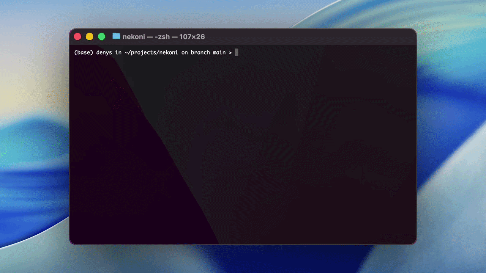
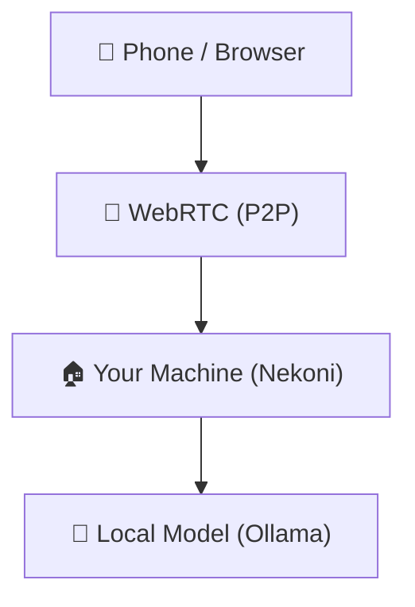

<p align="center">
  
</p>

# 🐱 Nekoni — Local AI Agent You Control From Your Phone

**[nekoni.dev](https://nekoni.dev)** · **[app.nekoni.dev](https://app.nekoni.dev)**

> Run your own AI. Own your data. Access it from your phone — no cloud required.



Nekoni is a self-hosted AI agent that runs on your machine and connects directly to your phone via WebRTC.

No cloud. No subscriptions. No data leaving your hardware.

## Features

- **Fully local** — LLM inference via Ollama, embeddings via sentence-transformers, vector search via ChromaDB
- **Phone access** — connect from mobile or web over direct WebRTC DataChannel
- **No cloud relay for data** — public signaling is used only for SDP/ICE exchange
- **Key-pair security** — Ed25519 identity keys and mutual authentication
- **RAG** — ingest documents and query them from chat
- **Skills** — reusable prompt templates with cron scheduling
- **Extensible** — add tools in a few lines of Python
- **Observable** — live trace stream in the dashboard

## Quick Start

```bash
curl -sSL https://github.com/nekonihq/nekoni/blob/main/install.sh | bash
```

Installs all dependencies, pulls the default model, and starts Nekoni. Requires ~4 GB disk space for the model.

**Stop / start:**

```bash
cd ~/.nekoni && make down
cd ~/.nekoni && make up
```

## Requirements

- macOS or Linux (Windows: use WSL2)
- Docker Desktop — installed automatically (Homebrew on macOS, get.docker.com on Linux)
- ~4 GB disk space for the Ollama model

## How It Works



Nekoni uses direct peer-to-peer communication between your device and your home machine. The public signal server is only used to establish the WebRTC connection.

More details:

- [Architecture](docs/architecture.md)
- [Security model](docs/security.md)

## Use Cases

- Private AI assistant at home
- Local alternative to cloud AI tools
- AI-powered automations on your own hardware
- Experimenting with local-first AI workflows
- Building custom tools and agent skills

## Documentation

- [Setup](docs/setup.md)
- [Architecture](docs/architecture.md)
- [Development](docs/development.md)
- [Web app](docs/web.md)
- [Mobile app](docs/mobile.md)
- [Configuration](docs/config.md)
- [API reference](docs/api.md)
- [Security](docs/security.md)

## ⭐ Support

If you find Nekoni useful:

- Star the repo
- Share your setup
- Build something on top of it
- Open issues and contribute improvements

## License

MIT
