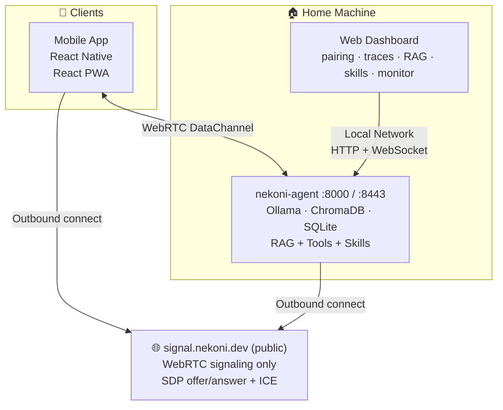

# Architecture

## System Overview



## Components

### Agent

The agent runs locally on the home machine and provides:

- LLM access through Ollama
- RAG ingestion and retrieval
- Tool execution
- Skills and cron scheduling
- Trace streaming
- Pairing and device approval APIs

### Signal Server

The signal server is public and is used only for:

- SDP offer / answer exchange
- ICE candidate exchange
- Initial peer discovery and room coordination

It does **not** relay chat or agent payloads.

### Dashboard

The dashboard runs locally and provides:

- Pairing approval
- Trace viewing
- Knowledge base management
- Skill and cron management
- Device monitoring

### Web App

The browser-based PWA provides:

- Chat
- RAG management
- Skills and cron management
- Settings and paired agents
- Conversation history

### Mobile App

The React Native app provides:

- QR pairing
- Chat
- Knowledge base access
- Skill management
- Agent settings

## Tech Stack

| Component  | Tech                                                                     |
| ---------- | ------------------------------------------------------------------------ |
| Agent      | Python 3.12 · FastAPI · uvicorn · aiortc                                 |
| Signaling  | Node.js 22 · TypeScript · ws · express                                   |
| Dashboard  | React 19 · Vite · TypeScript · Radix UI Themes                           |
| Mobile     | React Native · Expo · react-native-webrtc                                |
| Web App    | React 19 · Vite · TypeScript · PWA · qr-scanner                          |
| LLM        | Ollama (any model)                                                       |
| Embeddings | sentence-transformers (all-MiniLM-L6-v2)                                 |
| Vector DB  | ChromaDB (embedded, file-based)                                          |
| State      | SQLite + aiosqlite · IndexedDB (web app)                                 |
| Crypto     | Ed25519 — cryptography (Python) · @noble/ed25519 (Node) · tweetnacl (RN) |
| Monorepo   | pnpm workspaces + uv                                                     |

## Project Structure

```text
nekoni/
├── packages/
│   └── shared-types/
│       └── src/
│           ├── signaling.ts
│           └── agent.ts
├── apps/
│   ├── agent/
│   │   └── src/nekoni_agent/
│   │       ├── main.py
│   │       ├── config.py
│   │       ├── crypto/
│   │       ├── webrtc/
│   │       ├── agent/
│   │       ├── tools/
│   │       ├── skills/
│   │       ├── rag/
│   │       ├── memory/
│   │       ├── llm/
│   │       └── api/
│   ├── signal/
│   │   └── src/
│   │       ├── server.ts
│   │       ├── rooms.ts
│   │       └── handlers.ts
│   ├── dashboard/
│   │   └── src/
│   │       ├── pages/Pair.tsx
│   │       ├── pages/Traces.tsx
│   │       ├── pages/Monitor.tsx
│   │       ├── pages/Knowledge.tsx
│   │       ├── pages/Skills.tsx
│   │       └── pages/SkillEditor.tsx
│   ├── mobile/
│   │   └── src/
│   │       ├── app/(tabs)/chat.tsx
│   │       ├── app/(tabs)/knowledge.tsx
│   │       ├── app/(tabs)/skills.tsx
│   │       ├── app/(tabs)/settings.tsx
│   │       ├── app/pair.tsx
│   │       ├── ConnectionContext.tsx
│   │       └── hooks/
│   └── web/
│       └── src/
│           ├── contexts/
│           ├── pages/
│           ├── hooks/
│           ├── db/index.ts
│           ├── components/TabBar.tsx
│           └── App.tsx
├── data/
│   ├── keys/
│   ├── chroma/
│   ├── sqlite/
│   └── ollama/
├── docker-compose.yml
├── Makefile
```
