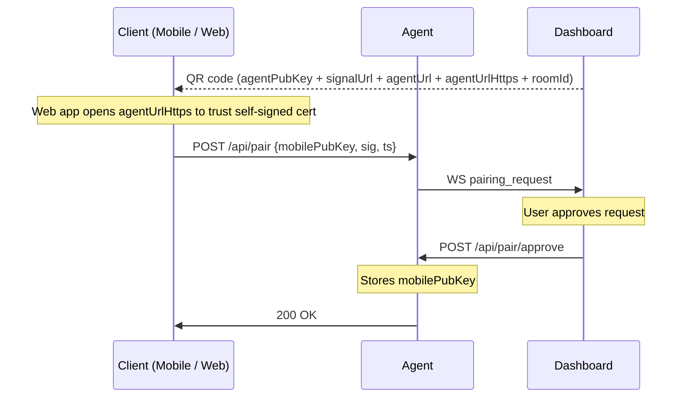
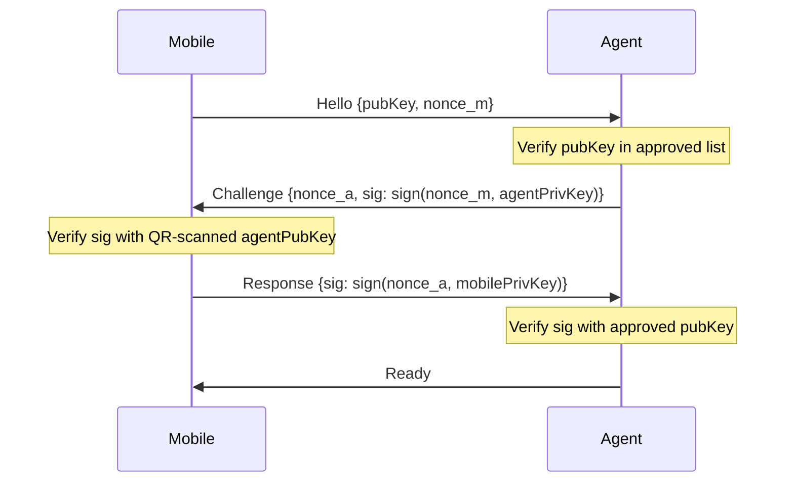

# Security Model

## Identity Keys

Both the agent and the client device have long-lived Ed25519 keypairs.

- **Agent key** — generated on first run and stored at `data/keys/agent_identity.pem`
- **Client key** — generated on first install and stored securely on the device

The public agent key is embedded in the QR code used during pairing.

## Pairing

Pairing is performed once per device on the local network.



The QR payload includes:

- `agentUrl` for mobile
- `agentUrlHttps` for the web app

## Signaling Authentication

Every WebSocket signaling message is signed.

```text
sig = base64url(Ed25519Sign(sha256(JSON.stringify(payload_without_sig)), senderPrivKey))
```

The signal server verifies signatures and enforces a ±5 minute timestamp window to reduce replay risk.

## DataChannel Mutual Authentication

After WebRTC opens, mutual authentication is performed before any normal messages are accepted.



The connection is dropped immediately on any authentication failure. There is no fallback mode.
